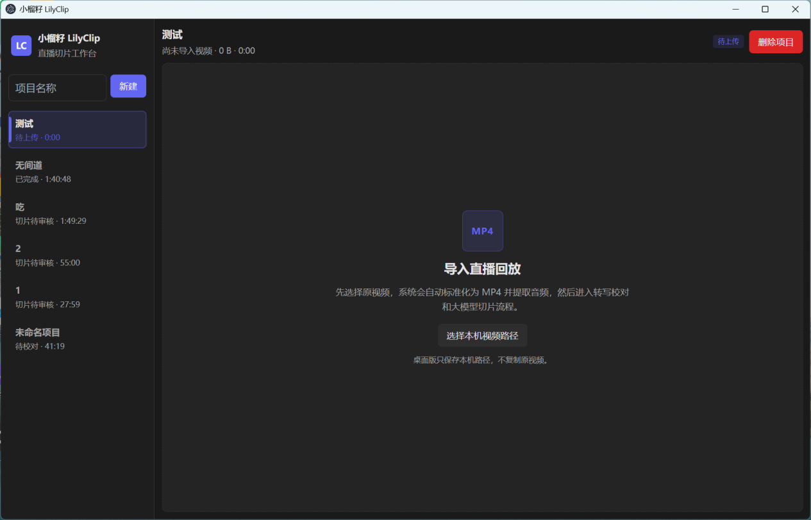
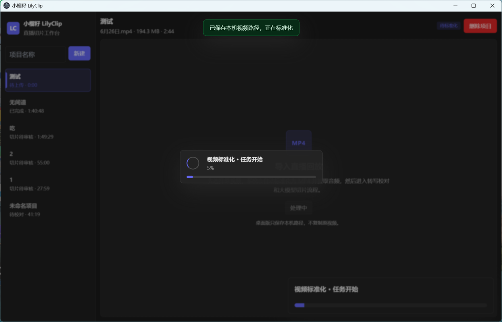
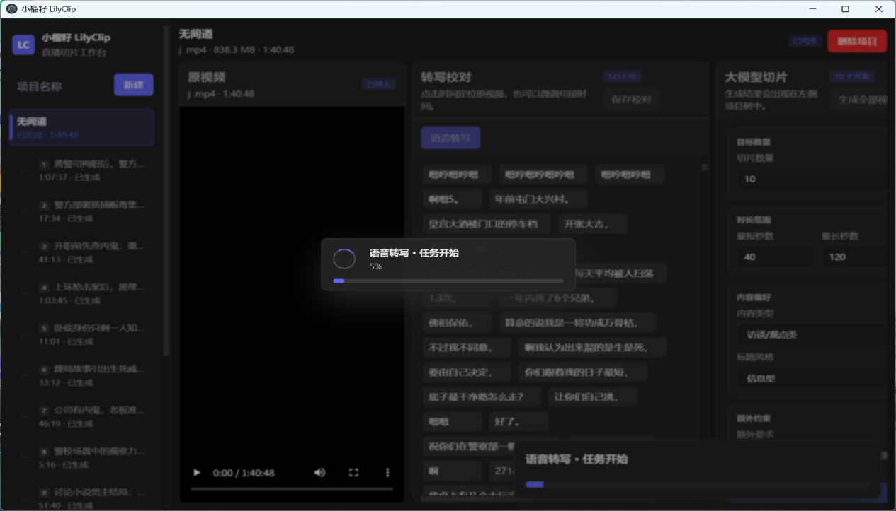
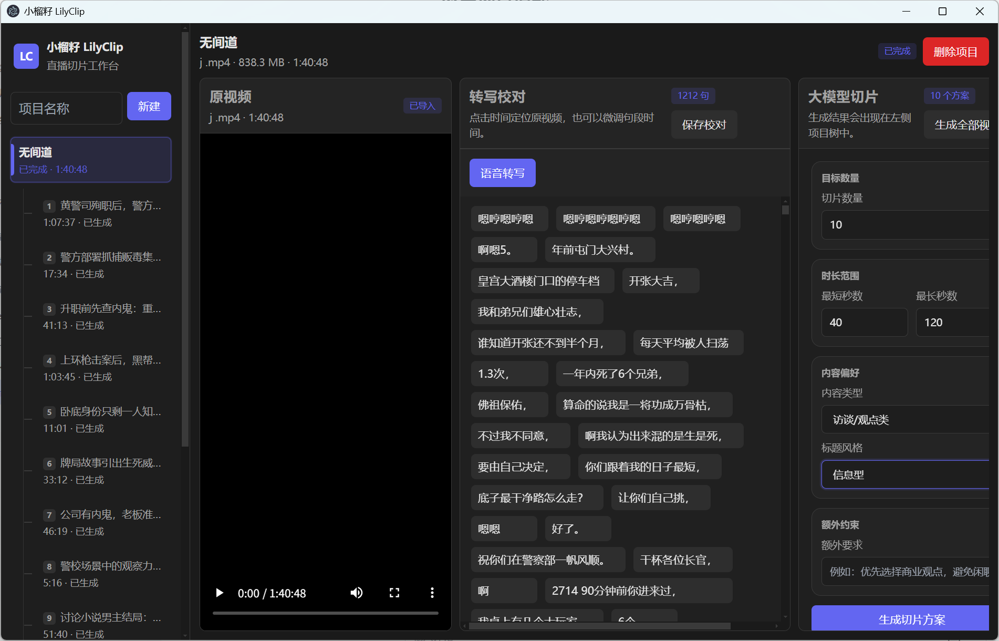

# lilyclip
Lilyclip is a AI clip creator, For a long video,  lilyclip use AI model to create 2-5 minutes short clip automatically
# 小榴籽 LilyClip - AI直播切片工具
[]
[]
[]

# 小榴籽 LilyClip

[
[

AI驱动直播回放智能剪辑与短视频生成工具，专为直播主播、电商商家、自媒体创作者、MCN机构打造，依托自研AI算法重构传统剪辑流程，解决直播回放剪辑耗时久、人工成本高、爆款率低、出片效率差等行业痛点，实现直播内容自动化、批量化、高品质二次创作，最大化每一场直播内容价值。

通过多模态AI算法将人工找高光转化为自动计算，并行处理音视频、文本多维数据，智能筛选精彩片段，全自动批量产出短视频素材。

*图1：直播切片工作台首页*

## 一、应用场景适配
### 知识博主
快速拆解知识类直播内容，全自动处理素材，单次剪辑可节省3小时人工成本，创作者可专注内容输出，减少重复剪辑工作。

### 带货主播
实现下播即出片，直播结束立刻产出商品卖点切片，抓住流量黄金窗口期，提升商品曝光与下单转化率。

### 游戏主播
AI精准识别五杀、反杀、极限操作等高能高光片段，自动标记精彩内容，持续产出吸粉短视频素材。

### 口播UP主
大幅缩短内容制作周期，更新频率可从周更提升至日更，高频稳定更新快速积累粉丝、放大账号影响力。

### 兼职剪辑/运营从业者
智能化流程大幅提升单人处理产能，同一时间承接更多账号剪辑需求，提升副业变现收益。

## 二、软件完整使用流程
### 1. 上传本地视频，自动标准化转码
导入本地直播回放视频，软件自动统一转码为MP4、提取音频文件；桌面版仅保存本地视频路径，不会复制原视频占用磁盘空间。

*图2：视频标准化转码页面*

### 2. 语音转写校对，自定义AI切片规则
视频处理完成后自动生成完整语音转写文本，支持手动修改、校对字幕内容；可自定义切片生成参数：
1. 自定义切片产出数量、单条切片最短/最长时长（推荐40~120秒）
2. 内容偏好分类：访谈/观点类、知识讲解、直播带货、其他素材
3. 标题输出风格：信息型、观点型、干货型、争议引流型
4. 自定义额外约束：例如要求片段节奏紧凑、自动剔除闲聊争吵片段等

配置完成后一键批量生成多套切片方案，可点击时间轴定位原视频，手动微调句段范围。

*图3：语音转写&AI切片设置面板*

### 3. 切片全局美化设置，批量导出MP4
对生成的所有切片统一精细化渲染配置，支持批量调整：
- 导出分辨率、画面宽高、画面偏移、缩放比例
- 标题&字幕自定义：字号、字体颜色、上下垂直位置、单行字数限制
- 画面滤镜、成片音量、静音压缩调节
- 自定义背景音乐导入
- 标题、字幕敏感词自动替换屏蔽

所有修改实时预览画面效果，配置完成后批量导出完整MP4短视频。

*图4：成片渲染与导出设置界面*

## 三、核心产品优势
1. 本地轻量化运行，无需上传完整直播原视频至云端，素材隐私更安全
2. 自研多模态AI自动识别商品讲解、金句观点、高能高光等优质片段
3. 一次性批量生成多条短视频方案，人工仅简单审核即可导出成片
4. 自动生成完整字幕，支持适配抖音、视频号、快手竖版短视频尺寸
5. 高度自定义AI切片逻辑，可根据账号、行业风格调整产出偏好
6. 低配Windows电脑流畅运行，无需高性能独立显卡

# LilyClip (Xiaoliuzi)

[]
[]

LilyClip is an AI-powered intelligent clip editing and short video generation tool for live stream recordings. It aims to free creators from repetitive, mechanical editing work. Tailored for live stream hosts, e-commerce merchants, self-media creators and MCN agencies, our self-developed AI algorithm reshapes traditional editing workflows.

It solves major industry pain points: time-consuming live footage editing, high labor costs, low hit clip output rate and poor production efficiency. The tool enables automated, batch, high-quality secondary creation of live content to maximize the commercial value of every live session.

Built on a multi-modal AI algorithm framework, it converts manual "highlight searching" into objective computational tasks. It processes multi-dimensional audio & video data in parallel, executes intelligent content analysis and automatic creative generation to produce high-quality highlight clips in bulk.

*Figure 1: Live Clip Workspace Interface*

## I. Applicable Scenarios
### Knowledge Streamers
Automatically split knowledge-based live streams and process footage in one click, cutting tedious manual post-production drastically. Save around 3 hours of editing work per live recording, letting creators focus on knowledge output instead of repetitive labor.

### E-commerce Live Streamers
Release short videos immediately after live streaming without long waiting, capturing peak traffic windows. Automatically generate highlight clips focusing on core selling points and push them to target audiences to lift product clicks and conversion rates.

### Gaming Streamers
Intelligent algorithms automatically capture highlight moments including pentakills, counter-kills and clutch gameplay, tagging all exciting segments. Never miss trending opportunities and continuously generate high-energy short videos to boost fan interaction and follower growth.

### Voiceover & Self-media Creators
Shorten content production cycles significantly, upgrading posting frequency from weekly to daily. Grow your audience base and expand account influence with stable high-frequency short video output.

### Part-time Editors & Operation Specialists
AI-driven workflow greatly improves individual processing capacity. Freelance editors can take more editing orders within limited working hours and increase side income efficiently.

## II. Software Operation Guide
### Step 1: Upload Local Videos for Automatic Transcoding
Import local live recording files. The software will automatically convert all videos to MP4 format and extract audio tracks. The desktop client only stores local file paths instead of copying the full original video to save disk storage.

*Figure 2: Video Standardization & Transcoding Interface*

### Step 2: Speech Transcription & Custom Clip Generation Rules
After video and audio processing completes, full speech transcripts will be generated automatically. You can manually edit and proofread all subtitles. Customize AI clip generation rules with flexible parameters:
1. Target clip quantity, minimum & maximum single clip duration (recommended range: 40–120 seconds)
2. Content category: Interview & Opinion, Knowledge Explanation, Live Stream Footage, Others
3. Title tone: Informative, Opinion-driven, Practical Tips, Controversy-triggered
4. Custom extra constraints: For example, compact video pacing, auto-filter argument segments, prioritize commercial selling points

After configuration, generate multiple clip solutions in one batch. Click the timeline to jump to original footage and manually adjust sentence segment ranges.

*Figure 3: Speech Transcription & AI Clip Setting Interface*

### Step 3: Global Render Settings & Bulk MP4 Export
Uniformly adjust rendering parameters for all generated clips with real-time preview:
- Export resolution, video width/height, offset and scaling ratio
- Title & subtitle customization: font size, color, vertical position, line limit
- Visual filters, output volume and mute compression
- Custom background music import
- Auto sensitive word replacement for all titles and subtitles

All adjustments take effect instantly on the preview panel. Export all finished MP4 clips in batches after setup.

*Figure 4: Rendering & Export Parameter Modification Panel*

## III. Core Advantages
1. Lightweight local operation, no full live footage upload to cloud, better privacy protection for original content
2. Self-developed multi-modal AI automatically identifies selling-point segments, core viewpoints and high-energy highlights
3. Batch generate dozens of clip drafts at once; only simple manual review required before export
4. Auto full subtitle generation, fully compatible with vertical short video sizes for TikTok, Video Account, Kuaishou
5. Highly customizable AI generation logic, adjustable for different industries and account styles
6. Smooth operation on low-spec Windows PCs, no high-end discrete GPU required

## IV. Download Channel
### Windows Client Download
Official Download Link: https://1.tokenzoo.com/download
- Only Windows supported for now; Mac version unavailable
- Android APK: Follow official WeChat official account and reply keyword "LilyClip" to get the installation package

### Version Plans
- Free Version: Basic clip functions with limited maximum output clips per task
- Enterprise Version: Unlimited clip output, multi-project batch management, cloud batch rendering and exclusive business technical support

## V. Business Cooperation
For enterprise bulk licensing, MCN customized development and private deployment consultation:
Company: StarCompute Intelligence

## VI. Product Roadmap
- v1.5: Multi-account project batch management, bulk package export
- v1.6: AI auto cover generation & viral title copywriting
- v2.0: Distributed cloud clip cluster, support ultra-long live video batch processing

---
### Repository Deployment Instructions
1. Create a folder named `assets` in the root directory of your GitHub repo
2. Put 4 interface screenshots into the folder with these filenames:
`main_ui.png`, `transcode_ui.png`, `config_ui.png`, `export_ui.png`
3. Replace download links and business contact info as needed before committing to the repository

## 四、下载渠道
### Windows客户端下载
官方下载地址：https://1.tokenzoo.com/download
- 当前仅支持Windows系统，暂无Mac客户端
- 安卓APK安装包：关注官方公众号回复「小榴籽」获取

### 版本区分
- 免费版：开放基础切片功能，单次生成切片数量存在上限
- 企业版：无切片数量限制、支持多项目批量管理、云端批量渲染、专属商务技术支持

## 五、商务合作
企业批量采购、MCN机构定制开发、私有化部署咨询：
对接企业：星算智联

## 六、产品迭代规划
- v1.5：新增多账号项目批量管理、批量打包导出功能
- v1.6：AI自动生成短视频封面、爆款引流标题文案
- v2.0：上线分布式云端切片集群，支持超长直播视频批量处理

---
### 仓库使用说明
1. 在仓库根目录新建 `assets` 文件夹
2. 将4张界面截图放入文件夹，分别命名：
`main_ui.png`、`transcode_ui.png`、`config_ui.png`、`export_ui.png`
3. 按需替换下载链接、商务联系方式即可直接提交仓库

## ✨ 核心产品亮点
1. 直播实时自动识别高光片段，无需人工盯播
2. 一键批量导出高清短视频，自带字幕、封面
3. 适配抖音/视频号/快手多平台尺寸
4. 轻量化Windows客户端，低配置电脑流畅运行

## 📥 快速下载安装
### Windows客户端
直链下载：https://1.tokenzoo.com/download
安卓APK：公众号回复「小榴籽」获取
> 无捆绑、免费基础版可用，企业版支持批量云端渲染

## 📖 使用教程
1. 导入直播回放/实时推流
2. 设置切片时长、关键词、字幕模板
3. 一键批量生成并导出

## 🧩 适用客户群体
直播电商、MCN机构、带货主播、AI内容创业团队

## 📋 更新路线图
- v1.5 上线多账号批量管理
- v1.6 接入AI文案自动配标题
- v2.0 云端分布式切片集群

## 🤝 联系我们
商务合作：yaojian@shujuyan.cn
飞书团队：星算智联
